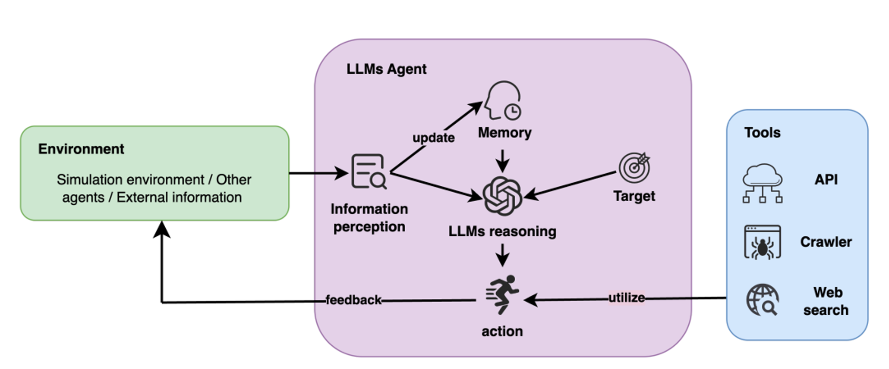
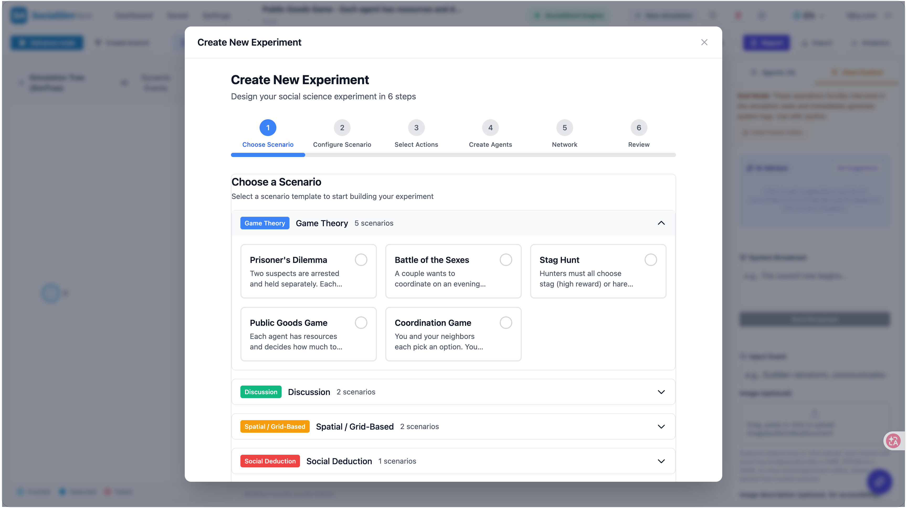
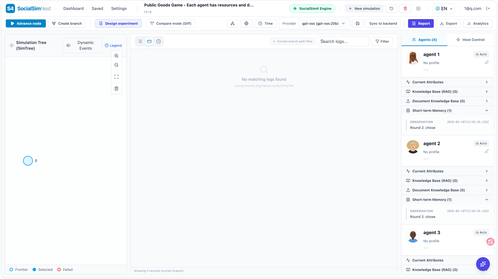
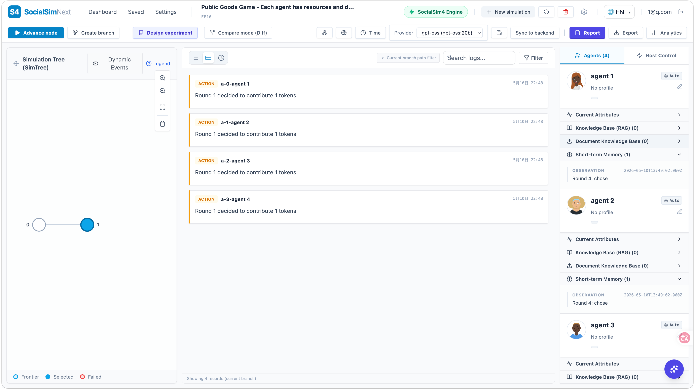
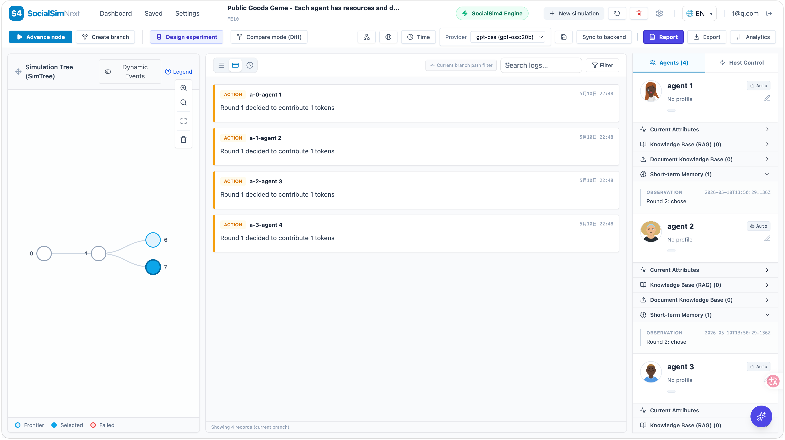

# Self Introduction

Zhichao Wang &nbsp;(王志超)

PhD Student (DC2) · Lab of Prof. Zeyu Lyu

<b>Tohoku University</b> · Faculty of Arts and Letters

wang.zhichao.p2@dc.tohoku.ac.jp &nbsp;·&nbsp; neowangzc.github.io

  <a href="https://neowangzc.github.io/" target="_blank" class="slidev-icon-btn" title="Homepage">
    <carbon:home />
  </a>
  <a href="https://github.com/neowangzc" target="_blank" class="slidev-icon-btn" title="GitHub">
    <carbon:logo-github />
  </a>
  <a href="https://scholar.google.com/citations?user=hoEP1cYAAAAJ&hl=en" target="_blank" class="slidev-icon-btn" title="Google Scholar">
    <carbon:education />
  </a>

<!--
Brief opener — name, role, what I do (in two phrases). 30 seconds.
-->

---
transition: fade-out
---

# About Me

I work at the intersection of <b>computational social science</b>, <b>AI</b>, and <b>social computing</b> — with a focus on how the social media actually works.

## Trajectory

- 🎓 **PhD in Behavioral Science** — Tohoku University, Faculty of Arts and Letters *(present)*
- 🎓 **MS in Computer Science** — Beijing Jiaotong University
- 🎓 **BS in Electronic Engineering** — University of Electronic Science and Technology of China

---
transition: slide-up
layout: two-cols
layoutClass: gap-10
---

# Past Research

Grouped by theme

🎯 Recommendation & Meta-Learning

<b>MIG: Cold-Start in Task Recommendations via Enhanced Meta Embeddings</b> 
Wang Z., Ma Y. — IEEE Int. Conf. on Systems, Man, and Cybernetics (SMC), 2024

<b>Multi-field Feature Interaction & Meta-learning for Online Labor Markets</b> 
Wang Z., Ma Y. — Int. Conf. on Logistics, Informatics and Service Sciences (ICLISS), 2023

<b>Online Labor Market Task Recommendation via Time-Weighted Diffusion Model</b> 
Du S., Wang Z., Ma Y. — Int. Conf. on Neural Information Processing (ICONIP), 2024

<b>Personalized Recommendation via Meta-learning for Gig-Economy Services</b> 
Ma Y., Wang Z., Tang M. et al. — IEEE Trans. on Consumer Electronics, 2023

::right::

📊 Big-Data Platform Analysis

<b>Regional Economic Conditions and Bidding Strategies in Online Labor Markets</b> 
Wang Z., Lyu Z. — IEEE Int. Conf. on Big Data, 2025

🤖 Generative Social Simulation

<b>From ABM to GABM: How Generative AI is Reshaping Social Simulation</b> 
Wang Z., Lyu Z. — Journal of Intelligent Society, 2025

📚 Narrative & Cultural Analytics

<b>Beyond Genre Categories: How Narrative Pattern Coherence and Spanning Distance Shape Film Success</b> 
NLP4DH Workshop @ ACL, 2026

🎤 Conferences & Talks

<b class="opacity-70">2026:</b> ICSD (oral, grant) · ASA · PAS · 数理社会学会 #80 (poster, grant)

<b class="opacity-70">2025:</b> ANPOR-APCA · Chinese Sociological Assoc. · 数理社会学会 #79 · Chinese Computational Sociology Conf. · 数理社会学会 #78 (poster, grant) · SICSS-HK

<b class="opacity-70">2023:</b> INFORMS · Sino-EU Doctoral Consortium (Best Presentation)

---
transition: slide-left
---

# Current Research

My recent work uses large language model agents for social simulation, exploring how complex social processes emerge.

<input class="loop-toggle" type="radio" name="loop-detail" id="loop-none" checked />
<input class="loop-toggle" type="radio" name="loop-detail" id="loop-environment" />
<input class="loop-toggle" type="radio" name="loop-detail" id="loop-agent" />
<input class="loop-toggle" type="radio" name="loop-detail" id="loop-tools" />

<label for="loop-environment" class="loop-zone loop-env" aria-label="Environment"></label>
<label for="loop-agent" class="loop-zone loop-agent" aria-label="LLMs Agent"></label>
<label for="loop-tools" class="loop-zone loop-tools" aria-label="Tools"></label>

<label for="loop-none" class="loop-close">×</label>

The World

<h3>Environment</h3>

This is the small society where the simulation happens. It contains other agents, outside information, rules about who can see what, and events we inject into the world.

When an agent acts, the environment changes. The next round starts from this updated world.

<label for="loop-none" class="loop-close">×</label>

The Actor

<h3>LLMs Agent</h3>

Think of this as a simulated person. It sees part of the world, remembers what happened before, thinks about its goal, and decides what to do next.

The LLM gives the agent a more human-like reasoning process, while the final action is still recorded clearly for comparison.

<label for="loop-none" class="loop-close">×</label>

Extra Senses

<h3>Tools</h3>

Tools let an agent look beyond its prompt. It can call an API, crawl a page, or search the web when the experiment allows it.

This makes the agent less like a closed chatbot and more like an actor using information channels in a real platform.

---
transition: slide-left
---

# From ABM to LLM-ABM

Classic ABM · fixed rules

<ul class="mt-auto text-[11px] opacity-85 space-y-0.5">
<li>People are represented as simple variables</li>
<li>The researcher writes the interaction rules</li>
<li>Good for testing one clear mechanism</li>
<li class="opacity-70 italic">Schelling 1971 · Axelrod 1984 · Epstein 1996</li>
</ul>

LLM-ABM · adaptive agents

A: "I trust this source, so I'll share it."

🤖

🤖

B: "I disagree. The comments make me doubt it."

C: "I'll wait and see how my network reacts."

🤖

<ul class="mt-auto text-[11px] opacity-85 space-y-0.5">
<li>Agents have roles, memory, and goals</li>
<li>Interaction rules can change with context</li>
<li>Useful when social processes are hard to write as rules</li>
<li class="opacity-70 italic">Park et al. 2023 · Argyle et al. 2023 · Horton 2023</li>
</ul>

Representation

<b class="text-purple-300">Variables → Simulated people</b> 
roles, memory, goals, and social position

Interaction Rules

<b class="text-purple-300">Fixed rules → Context-sensitive rules</b> 
responses change with situation and history

Modeling Scope

<b class="text-purple-300">Simple cases → Hard-to-model processes</b> 
study behavior that is difficult to predefine

---
transition: slide-up
---

# Current Project · SocialSim4

An LLM-native agent simulation platform designed for social science research and experimentation.

It turns social-science theory into testable simulations: configure agents, vary environments and interventions, then observe what changes.

Features

  
LLM-native agents

  <b class="text-slate-900">Roles, memory, and actions</b> 
  agents decide from prompts, context, available actions, and past events

  
Scenario templates

  <b class="text-slate-900">Reusable social settings</b> 
  start from preset or custom worlds with rules, mechanics, and actions

  
Population builder

  <b class="text-slate-900">Create agent groups</b> 
  use preset agents, AI-generated agents, or imported CSV/JSON populations

SimTree branching

<b class="text-slate-900">Counterfactual timelines</b> 
advance nodes, create branches, and compare what changes after an intervention

Environment events

<b class="text-slate-900">Contextual shocks</b> 
inject policy changes, rumors, emergencies, or public-opinion shifts

Traceable runs

<b class="text-slate-900">Logs for inspection</b> 
save prompts, responses, actions, timelines, and simulation state

---
transition: slide-up
---

# SocialSim4 · Workflow Loop

The goal is to turn social-science hypothesis into a testable simulation, then use the result to refine the next hypothesis.

<svg class="workflow-ring absolute inset-0 h-full w-full" viewBox="0 0 990 430" aria-hidden="true">
  <defs>
    <marker id="workflow-arrow" markerWidth="8" markerHeight="8" refX="7" refY="4" orient="auto">
      <path d="M0,0 L8,4 L0,8 Z" fill="rgba(20, 184, 166, 0.72)" />
    </marker>
  </defs>
  <path d="M495 44 C720 44 875 118 875 215 C875 312 720 386 495 386 C270 386 115 312 115 215 C115 118 270 44 495 44 Z" />
</svg>

    <svg class="tri-cycle" viewBox="0 0 300 260" aria-label="Theory simulation evidence loop">
      <defs>
      <marker id="tri-cycle-arrow" markerWidth="7" markerHeight="7" refX="6" refY="3.5" orient="auto">
        <path d="M0,0 L7,3.5 L0,7 Z" />
      </marker>
    </defs>
    <path class="tri-cycle-arrow-path" d="M163 68 L230 158" />
    <path class="tri-cycle-arrow-path" d="M198 188 L102 188" />
    <path class="tri-cycle-arrow-path" d="M70 158 L137 68" />
    <text x="150" y="52" text-anchor="middle">Theory</text>
    <text x="242" y="214" text-anchor="middle">Simulation</text>
    <text x="58" y="214" text-anchor="middle">Evidence</text>
  </svg>

  <b>1. Start from social-science theory</b>
  hypothesis, mechanism, expected outcome

  <b>2. Operationalize the mechanism</b>
  actors, variables, interaction rules

  <b>3. Build the simulation setting</b>
  agents, environment, network, actions

  <b>4. Run the baseline timeline</b>
  observe actions, messages, and logs

  <b>5. Branch an intervention</b>
  change policy, information, or network

  <b>6. Compare and revise theory</b>
  inspect differences and update hypothesis

---
transition: slide-left
---

# SocialSim4 · Scenario Library

We include classic social-science studies as reusable simulation templates.

---
transition: slide-left
---

# Example 1 · Baseline Simulation

Start with one configured social world: agents, scenario settings, and an empty timeline before any interaction happens.

---
transition: slide-left
level: 2
hideInToc: true
---

# Example 2 · Advancing the Timeline

Clicking <b>Advance Node</b> runs the next round, turning agent decisions into visible actions, messages, and logs.

<a href="./9" class="abs-tr mt-5 mr-8 rounded border border-slate-300/40 px-3 py-1.5 text-xs opacity-75 hover:opacity-100">
× Back to initial state
</a>

---
transition: slide-left
level: 2
hideInToc: true
---

# Example 3 · Counterfactual Branch

Clicking <b>Create Branch</b> copies the current state, so one condition can be changed while keeping the original timeline for comparison.

<a href="./9" class="abs-tr mt-5 mr-8 rounded border border-slate-300/40 px-3 py-1.5 text-xs opacity-75 hover:opacity-100">
× Back to initial state
</a>

---
layout: center
class: text-center
---

# Thanks

Questions, collaborations, ideas — all welcome.

📧 <a href="mailto:neo.wangzc@gmail.com">neo.wangzc@gmail.com</a> &nbsp;·&nbsp; 🏠 <a href="https://neowangzc.github.io/" target="_blank">neowangzc.github.io</a>

  <carbon:logo-github class="inline" /> <a href="https://github.com/neowangzc" target="_blank">@neowangzc</a>
  &nbsp;·&nbsp;
  <carbon:education class="inline" /> <a href="https://scholar.google.com/citations?user=hoEP1cYAAAAJ&hl=en" target="_blank">Scholar</a>
  &nbsp;·&nbsp;
  <carbon:document class="inline" /> <a href="https://researchmap.jp/zhichaowang" target="_blank">ResearchMap</a>

