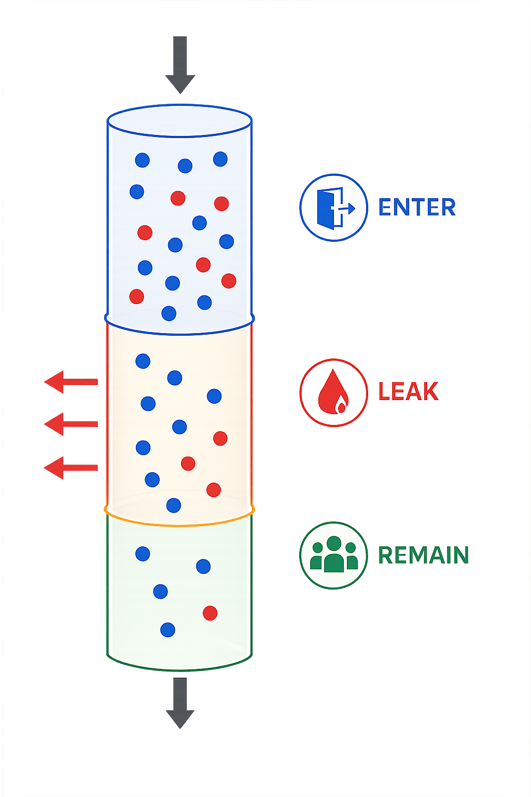

  
  
Session: Work and Employment | PAS 2026 Annual Conference

  

    <h1 class="claim wide" style="font-size:48px; line-height:1.08; max-width:1080px; margin-top:0; color:#000000;">Winning Doesn’t Fix the Leak</h1>
    
Gendered Interpretation of Feedback in Online Labor Markets

    
Wang Zhichao, Lyu Zeyu

  

  

    Presented by Wang Zhichao 
    PhD student, Graduate School of Letters, Tohoku University
  

<!--
Good afternoon, everyone. I am Zhichao Wang, a doctoral student at Tohoku University.

The title of today's presentation is "Winning Doesn't Fix the Leak: Gendered Interpretation of Feedback in Online Labor Markets."
-->

---

  
INTRODUCTION

  <h2 class="claim wide">The Leaky Pipeline</h2>
  

    

      
Female entry into male-typed works(eg. IT) rises

      
Female more likely than men to leave male-typed works

      
Occupational segregation persists

    

    
  

  
02

<!--
Over the past two decades, we've seen substantial progress in women's entry into traditionally male-typed fields such as software, data science, and engineering. But entry is only part of the story.

A growing body of research shows that women are also more likely than men to leave these fields after entering them. So even as more women flow into these occupations, women remain underrepresented overall.

This is the phenomenon often described as the "leaky pipeline." Women enter a male-typed domain, but are gradually lost at every stage over time. As we move toward senior positions or long-term career trajectories, very few women remain.

Most prior work focuses on entry and exit. But the process in between — what actually happens inside this leaky pipeline — remains largely unexplored. That's the gap we want to address.
-->

---

  
INTRODUCTION

  <h2 class="claim wide">Gendered Interpretation of Employer Feedback</h2>
  

    

<b>Prior outcomes shape what workers do next</b>

Approval or rejection influences where workers apply next.

    

    

      

        01
        
<b>Ability</b>
Can I do this job?

      

      

        02
        
<b>Belonging</b>
Do I belong in this work?

      

    

  

  
The meaning of success and failure may differ by gender in male-typed work.

  
03

<!--
There are many possible mechanisms behind this process. In this study, we focus on one in particular: success and failure signals from employers may shape workers' commitment to specific fields by gender.

As we know, prior outcomes guide what we do next. When you apply for a job and you get accepted, or you get rejected, that experience is not just an outcome — it carries information.

These signals tell us two things: "Can I actually do this job?" and "Do I belong in this kind of work?" Together, they shape where you apply next.

We argue that the meaning of success and failure may differ by gender in male-typed work. A man and a woman who receive the same rejection from an IT project are not hearing the same thing. The man hears: "I lost this one." The woman may hear: "This is not a place for me." The same feedback, two different interpretations. That is the mechanism we want to test.
-->

---

  
INTRODUCTION

  <h2 class="claim wide">How Online Labor Markets Work</h2>
  

    

      

        

          01
          <b>Employer posts a project</b>
        

        

          01
          <b>Employer posts a project</b>
        

      

      

      

        

          02
          <b>Freelancers bid</b>
        

        

          02
          <b>Freelancers bid</b>
        

      

      

      

        

          03
          <b>Employer selects one</b>
        

        

          03
          <b>Employer selects one</b>
        

      

    

    

      

        
      

      

        

          

            
            <b>Online Labor Market</b>
            <em>Synthetic example</em>
          

          

            
Project brief

            <h3>Build a personal website</h3>
            

              Category: IT & Software
              Budget: $500-750
            

            
Build a personal academic homepage for me

            

              CSSDatabaseUIAPI
            

          

          

            
<b>Posted</b>10 minutes ago

            
<b>Open</b>Accepting bids

            
<b>Bidding ends in</b> 6 days

          

        

      

      

        

          

            
            <b>Online Labor Market</b>
            <em>Synthetic example</em>
          

          

            

              
Submit bid

              <h3>Apply for the project</h3>
              
Bid amount<b>$640</b>

              
Delivery time<b>14 days</b>

              
I can build the website in 1 day.

            

            

              
<twemoji-man-technologist class="proposal-avatar"/>Worker A<b>$620</b>

              
<twemoji-woman-technologist class="proposal-avatar"/>Worker B<b>$640</b>

              
<twemoji-man-technologist class="proposal-avatar"/>Worker C<b>$700</b>

            

          

        

      

      

        

          

            
            <b>Online Labor Market</b>
            <em>Synthetic example</em>
          

          

            

              
Selection outcome

              
Employer selects one workers from all participants

            

            

              <b>Worker B</b>
              <em>Contract awarded</em>
            

          

          

            
Worker B<b>Approved</b>

            
Worker A<b>Rejected</b>

            
Worker C<b>Rejected</b>

          

        

      

    

  

  
04

<!--
Online labor markets give us a suitable setting for our research. These are digital platforms that connect employers with remote workers to complete short-term projects over the internet. Let me briefly introduce how this market works.

First, an employer posts a project on platform. In this example, the employer is looking for someone to build a personal homepage. They specify a budget, choose a project category — here, IT and Software — and list the required skills.

Next, freelancers from around the world submit bids. Each bid includes a proposed price, delivery time, and a short self-introduction. Through a freelancer's profile, we can get basic information about the worker, such as their name, gender, or race.
In this example, we see two male workers and one female worker bidding for the same project.

Finally, the employer selects one worker from the pool of bidders. The selected worker wins the contract, while the others are rejected. Every bidder can observe this outcome,so each bid generates a feedback signal for workers.

On the platform, workers bid for projects constantly, and every bid produces a visible outcome. We can observe the full history for each worker across their entire trajectory on the platform.
-->

---

  
Motivation

  <h2 class="claim wide">Research Gap.</h2>
  

    

      

        
Gap 1

        
Asked only whether rejected workers <b>reapply to the same employer</b> 
        

      

      
→

      

        
Q1

        
Do men and women differ in how feedback shapes whether they stay in or reallocate away from a specific domain?

      

    

    

      

        
Gap 2

        
Treated job domains as uniform — ignoring that domains are <b>gender-typed differently</b>

      

      
→

      

        
Q2

        
Does this response depend on the work type — the domain's gender-typing?

      

    

  

  
05

<!--

Prior research mainly focus on how a rejected worker reapplies to the same employer. That's useful, but it misses the job domains. So our first question is: do men and women differ in how feedback shapes whether they stay in, or move away from, a specific domain?

Second, most of this work has treated job domains as if they were uniform. But domains are gender-typed — some coded male, some female — and the same feedback may mean very different things depending on where you stand. That's our second question.
-->

---

  
THEORY

  <h2 class="claim wide">Female Workers in Male-Typed Work</h2>
  

    

      

        <b>Bias awareness</b>
        
Women know employers tend to undervalue them in male-typed works.

      

    

    

      

        <b>Lower self-assessment</b>
        
Cultural beliefs tie technical competence more strongly to men than women.

      

    

    

      

        <b>Token position</b>
        
As minorities in male-typed works, each success reads as exception, not evidence of fit.

      

    

  

  
06

<!--
Based on these two questions, we reviewed the research on women in male-typed work, and found some mechanisms.

Women in male-typed work know employers tend to undervalue them. Every rejection is read against that background.

Cultural beliefs connect technical competence more strongly to men. Women walk in with a lower prior on themselves.

As women are a minority in male-typed work, each success is read as an exception — not as evidence they belong.
-->

---

  
Hypotheses

  <h2 class="claim">In male-typed work, feedback acts asymmetrically.</h2>
  

    

H1

Discounted Success: Wins anchor women to IT less than they anchor men.

    

H2

Amplified Failure: Losses push women out of IT faster than they push men.

    

H3

The feedback asymmetry appears only where women are underrepresented.

  

  
07

<!--
Thus, we propose three hypotheses.

H1 — Discounted Success. In male-typed work, wins anchor women less than they anchor men. Even when a woman wins a male-typed project, that win does not pull her further into the field.

H2 — Amplified Failure. Losses push women out of male-typed work faster than they push men.

H3 — Domain Specificity. This feedback asymmetry should appear only where women are underrepresented — that is, only in male-typed work.
-->

---

  
Data And Methods

  <h2 class="claim wide">Data overviews</h2>
  
We collected Freelancer.com data from 2000 to 2017 and track each worker over their first two years on the platform1.

  

    
<b>446K</b>workers

    
<b>455K</b>projects

    
<b>3.16M</b>bids

  

  

    

      
Male-typed work

      <h3>IT &amp; Programming Starters</h3>
      
<b style="color:#2563eb; font-size:60px;">11.7%</b>female

    

    

      
Female-typed work

      <h3>Writing &amp; Translation Starters</h3>
      
<b style="color:#dc2626; font-size:60px;">44.9%</b>female

    

  

  
[1] Most freelancers leave the platform within 1.7 years, average work activity lasts about 28 weeks.08

<!--
We collected data from Freelancer.com, one of the largest online labor markets in the world. For each worker, we track the first two years of their platform career.

We focus on workers whose platform career began in one of the two most representative domains, and examine their commitment to the starting domain by gender. IT and Programming is our male-typed domain — its female share is the lowest on the platform, at 11.7%. Writing and Translation is our female-typed counterpart, where the female share is nearly balanced, at 44.9%.
-->

---

  
Data And Methods

  <h2 class="panel-clean-title">Panel Structure</h2>
  

    

      
Input

      <h3>Feedback accumulated from w₁ to wₜ</h3>
      

        
<b>Cumulative wins (log)</b><em>prior accepted bids</em>

        
<b>Failure rate</b><em>prior rejected bids/all bids</em>

        
<b>Cumulative wins × Female</b><em>gender interaction</em>

        
<b>Failure rate × Female</b><em>gender interaction</em>

      

    

    

      predict
      <i></i>
    

    

      
Output

      <h3>Outcome at window wₜ₊₁</h3>
      

<b>Total bids</b><em>overall activity</em>

<b>Domain share</b><em>% of bids in IT</em>

<b>First outside bid</b><em>onset of exploration</em>

<b>Domain exit</b><em>stops bidding in IT</em>

      

    

    <svg class="panel-clean-axis" viewBox="0 0 1100 170" role="img" aria-label="Biweekly panel windows from w1 to w t plus one">
      <g class="clean-axis-zone feedback" v-click="1">
        <rect x="36" y="38" width="800" height="96" rx="8"></rect>
      </g>
      <g class="clean-axis-zone outcome" v-click="3">
        <rect x="880" y="38" width="158" height="96" rx="8"></rect>
      </g>
      <line class="clean-axis-line" x1="52" y1="96" x2="1048" y2="96"></line>
      <g class="clean-window"><rect x="52" y="78" width="118" height="36" rx="8"></rect><text x="111" y="101">w₁</text></g>
      <g class="clean-window"><rect x="218" y="78" width="118" height="36" rx="8"></rect><text x="277" y="101">w₂</text></g>
      <g class="clean-window"><rect x="384" y="78" width="118" height="36" rx="8"></rect><text x="443" y="101">w₃</text></g>
      <text class="clean-ellipsis" x="566" y="103">...</text>
      <g class="clean-window emphasized feedback"><rect x="690" y="76" width="132" height="40" rx="9"></rect><text x="756" y="102">wₜ</text></g>
      <g class="clean-window emphasized outcome"><rect x="895" y="76" width="132" height="40" rx="9"></rect><text x="961" y="102">wₜ₊₁</text></g>
    </svg>
    
We partition each worker’s bidding history into consecutive biweekly windows1 to construct a panel dataset.

  

  
[1] We use biweekly windows because they are long enough to capture a typical posting-and-feedback cycle in Freelancer.com.09

<!--
We partition each worker's bidding history into biweekly windows.

For each window, we measure the feedback the worker has accumulated up to that point. Specifically: cumulative wins — how many prior bids were accepted; failure rate — the share of prior rejected bids; and both of these interacted with a female indicator, which is what lets us test gender differences.

These cumulative feedback measures are then used to predict outcomes in the next window. We look at four outcomes: how active the worker is;  how concentrated their effort is in the starting domain; when, for the first time, the worker places a bid outside their starting domain; and  whether the worker stops bidding in IT altogether.
-->

---

  
Result | H1 

  <h2 class="claim wide">Wins anchor women less.</h2>
  

    

    
<b>Main effect of Wins</b>

    
<b>Female × Wins</b>gender additional effect

    
Total bids

    

      
+0.24***

      
wins increase activity

    

    

      
+0.68**

      
women are more encouraged

    

    
IT share

    

      
+0.09***

      
wins anchor workers to IT

    

    

      
−0.02***

      
women are anchored less

    

    
First outside

    

      
−0.04***

      
wins delay outside exploration

    

    

      
+0.06***

      
that protection fades for women

    

    
Domain exit

    

      
−0.05***

      
wins prevent exit IT works

    

    

      
−0.01**

      
slightly stronger for women

    

  

  
Note: + P &lt; .10, * P &lt; .05, ** P &lt; .01, *** P &lt; .001. All models include individual fixed effects; standard errors in parentheses are clustered at the individual level.10

<!--
We regressed each of the four outcomes on cumulative wins and its interaction with the female indicator.

We found that
Wins engage women on the platform overall — they bid more, they stay longer. But on the domain outcomes, wins don't anchor women into IT the way they anchor men, and they don't slow women's move out of IT.

The overall pattern is consistent with H1: women's wins translate into general activity, but the anchoring effect of success is weaker for women than for men.
-->

---

  
Result | H2

  <h2 class="claim wide">Failures push women out faster.</h2>
  

    

    
<b>Main effect of Failure</b>

    
<b>Female × Failure</b>gender additional effect

    
Total bids

    

      
−1.17***

      
failure reduces activity

    

    

      
+0.06

      
women do not differ

    

    
IT share

    

      
−0.18***

      
failure pushes workers out of IT

    

    

      
−0.09***

      
women are pushed out faster

    

    
First outside

    

      
+0.08***

      
failure accelerates outside exploration

    

    

      
+0.06***

      
women explore outside faster

    

    
Domain exit

    

      
+0.12***

      
failure pushes workers toward exit

    

    

      
+0.02***

      
women are more likely to exit

    

  

  
Note: + P &lt; .10, * P &lt; .05, ** P &lt; .01, *** P &lt; .001. All models include individual fixed effects; standard errors in parentheses are clustered at the individual level.11

<!--
Similarly, on the failure side: we find failure reduces activity for everyone equally.

But on the domain outcomes, failure pushes women out of IT faster than men — they move outside sooner, their IT share drops more steeply, and they exit IT more readily.

That is consistent with H2: failure has a stronger effect on leaving IT for women than for men.
-->

---

  
Result | H3

  <h2 class="claim wide">The feedback asymmetry is domain-specific.</h2>
  

    

    

    
<b>IT</b>

    
<b>Writing</b>

    
Female × Wins

    
Domain share

    
−0.020***

    
+0.006 n.s.

    
First outside

    
+0.056***

    
−0.018**

    
Domain exit

    
−0.009**

    
+0.008**

    
Female × Failure

    
Domain share

    
−0.086***

    
+0.094***

    
First outside

    
+0.061***

    
−0.018***

    
Domain exit

    
+0.017***

    
+0.006 n.s.

  

  
The Writing comparison does not show the same female penalty observed in IT. Instead, the interactions are either statistically null or run in the opposite direction

  
Note: + P &lt; .10, * P &lt; .05, ** P &lt; .01, *** P &lt; .001. All models include individual fixed effects; standard errors in parentheses are clustered at the individual level.12

<!--
Finally, we tested whether this gender difference in feedback response is something that shows up everywhere, or is concentrated in gender-specific work.

We rerun the same models on Writing and Translation, and we found that the penalty on women we saw in IT doesn't appear in Writing.

It appears only where women are underrepresented — that is, only in male-typed work. This supports H3.
-->

---

  
Contribution And Discussion

  <h2 class="claim wide">Contribution and Discussion</h2>
  

    

      
<b>Theoretical contribution:</b> shifts attention from entry barriers to the leak pipeline.

      
<b>Empirical contribution:</b> shows that gendered interpretation of feedback is asymmetric in OLMs.

    

    

      
Addressing occupational segregation calls for attention not only to entry opportunities, but also to the conditions that sustain women's presence and support their advancement.

    

  

  
Closing slide13

<!--
In this study, we shift attention away from the entry barrier toward the leak inside the pipeline. And we show that gendered interpretation of feedback in online labor markets is asymmetric — women's wins are discounted, losses are amplified — and this asymmetry appears only where women are underrepresented.

Getting more women into male-typed work is necessary, but not sufficient. We also have to make sure that, once they are there, every win counts, and every loss is just a loss — not a judgment on whether they belong.
-->

---

  
Thank You

  

    <h1 class="claim wide" style="font-size:56px; line-height:1.08; max-width:1080px; margin-top:0; color:#000000;">Thank you!</h1>
    
Questions and comments are very welcome.

  

  

    Wang Zhichao, Lyu Zeyu 
    Graduate School of Letters, Tohoku University
  

  
Thank you14

<!--
Thank you for listening. I'd be very happy to take your questions.
-->

